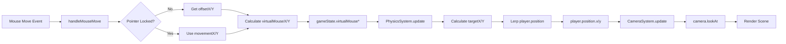

# Debug Inventory: Problema de Posicionamento do Avião

## 🐛 Descrição do Bug

**Sintoma**: Quando o mouse está centralizado, o avião NÃO está centralizado.

**Comportamento Esperado**: Mouse no centro → Avião no centro  
**Comportamento Atual**: Mouse no centro → Avião deslocado

---

## 🔍 Cadeia de Transformação de Coordenadas

### 1. Evento de Mouse → Coordenadas Virtuais

**Arquivo**: `InputSystem.ts` (linhas 84-123)

#### Modo Pointer Lock (Não Usado Atualmente)

```typescript
// Linhas 86-96
if (gameState.isPointerLocked) {
  gameState.virtualMouseX += e.movementX * gameState.mouseSensitivity;
  gameState.virtualMouseY += e.movementY * gameState.mouseSensitivity;
  
  // Clamp to -1 to 1
  gameState.virtualMouseX = Math.max(-1, Math.min(1, gameState.virtualMouseX));
  gameState.virtualMouseY = Math.max(-1, Math.min(1, gameState.virtualMouseY));
}
```

#### Modo Normal (ATIVO - CRÍTICO PARA O BUG)

```typescript
// Linhas 97-122
else {
  if (!containerRef.current) return;
  
  const rect = containerRef.current.getBoundingClientRect();
  const offsetX = e.offsetX;  // ⚠️ Relativo ao elemento
  const offsetY = e.offsetY;  // ⚠️ Relativo ao elemento
  
  // Normalizar para range -1 a 1
  gameState.virtualMouseX = (offsetX / rect.width) * 2 - 1;
  gameState.virtualMouseY = -(offsetY / rect.height) * 2 + 1;
  
  // DEBUG LOG (10% das vezes)
  if (Math.random() < 0.1) {
    console.log('🎮 Mouse Debug:', {
      offsetX,
      offsetY,
      rectWidth: rect.width,
      rectHeight: rect.height,
      virtualX: gameState.virtualMouseX.toFixed(2),
      virtualY: gameState.virtualMouseY.toFixed(2),
      isInBounds: offsetX >= 0 && offsetX <= rect.width && offsetY >= 0 && offsetY <= rect.height
    });
  }
}
```

**Fórmulas de Conversão**:
```
virtualMouseX = (offsetX / rect.width) * 2 - 1
virtualMouseY = -(offsetY / rect.height) * 2 + 1
```

**Exemplo**:
- Mouse no centro: `offsetX = rect.width/2`, `offsetY = rect.height/2`
- `virtualMouseX = (rect.width/2 / rect.width) * 2 - 1 = 0.5 * 2 - 1 = 0` ✅
- `virtualMouseY = -(rect.height/2 / rect.height) * 2 + 1 = -0.5 * 2 + 1 = 0` ✅

---

### 2. Coordenadas Virtuais → Posição do Avião

**Arquivo**: `PhysicsSystem.ts` (linhas 12-28)

```typescript
// Linha 15-16: Horizontal
const maxX = 30;
const targetX = gameState.virtualMouseX * maxX;

// Linhas 19-24: Vertical
const minY = 1.0;
const maxY = 12.0;
const heightRange = maxY - minY;  // 11.0
const normalizedY = (Math.max(-1, Math.min(1, gameState.virtualMouseY)) + 1) / 2;
const targetY = minY + normalizedY * heightRange;

// Linhas 27-28: Smooth lerp
player.position.x = THREE.MathUtils.lerp(player.position.x, targetX, 0.1);
player.position.y = THREE.MathUtils.lerp(player.position.y, targetY, 0.1);
```

**Fórmulas de Conversão**:
```
targetX = virtualMouseX * 30
targetY = 1.0 + ((virtualMouseY + 1) / 2) * 11.0
```

**Exemplo (Mouse Centralizado)**:
- `virtualMouseX = 0` → `targetX = 0` ✅
- `virtualMouseY = 0` → `normalizedY = 0.5` → `targetY = 1.0 + 0.5 * 11.0 = 6.5` ✅

---

### 3. Posição do Avião → Posição da Câmera

**Arquivo**: `CameraSystem.ts` (linhas 58-63)

```typescript
// MODO DEBUG ATUAL (Câmera Fixa)
camera.position.set(0, 5, player.position.z + 10);
camera.lookAt(0, 0, player.position.z - 20);
```

**⚠️ PROBLEMA IDENTIFICADO**: A câmera está olhando para `(0, 0, z)` independente da posição do avião!

**Código Comentado** (linhas 64-85):
```typescript
/*
camera.position.z = THREE.MathUtils.lerp(camera.position.z, targetZ, 0.1);
camera.position.y = THREE.MathUtils.lerp(camera.position.y, targetY, 0.1);
camera.position.x = THREE.MathUtils.lerp(camera.position.x, player.position.x * 0.5, 0.1);

camera.lookAt(
  player.position.x,
  player.position.y,
  player.position.z - 20
);
*/
```

---

## 📊 Variáveis Críticas

### GameState (Inicialização)

**Arquivo**: `NeonFlightGame.tsx` (linhas 112-114)

```typescript
virtualMouseX: 0,        // Inicializado em 0 (centro)
virtualMouseY: 0,        // Inicializado em 0 (centro)
mouseSensitivity: 0.002, // Usado apenas em pointer lock mode
```

**Reset no startGame** (linhas 511-512):
```typescript
gameState.virtualMouseX = 0;
gameState.virtualMouseY = 0;
```

### Player Position (Inicialização)

**createPlayerMesh** (linha 406):
```typescript
group.position.set(0, 5, 0);
```

**resetPhysics** (linha 459):
```typescript
if (playerRef.current) playerRef.current.position.set(0, 3.5, 0);
```

### Camera Position (Inicialização)

**Linha 145**:
```typescript
camera.position.set(0, 2.0, 5.0);
```

---

## 🔧 Sistemas de Coordenadas

### 1. Sistema de Coordenadas do Mouse

```
Screen Space (Pixels):
  ┌─────────────────┐
  │ (0,0)           │
  │                 │
  │        •        │ (offsetX, offsetY)
  │                 │
  │     (width,height)
  └─────────────────┘
```

### 2. Sistema de Coordenadas Virtual

```
Normalized Space:
  (-1, 1) ─────────── (1, 1)
     │                  │
     │        •         │ (virtualMouseX, virtualMouseY)
     │      (0,0)       │
     │                  │
  (-1,-1) ─────────── (1,-1)
```

### 3. Sistema de Coordenadas do Mundo 3D

```
World Space (Three.js):
       Y (up)
       │
       │
       │
       └────── X (right)
      /
     /
    Z (forward/backward)

Airplane Range:
  X: -30 to 30
  Y: 1.0 to 12.0
  Z: moves forward (negative Z)
```

---

## 🎯 Possíveis Causas do Bug

### 1. ⚠️ Offset do Container (ALTA PROBABILIDADE)

**Problema**: `e.offsetX` e `e.offsetY` são relativos ao elemento que disparou o evento.

**Verificação Necessária**:
- O evento está sendo disparado no `containerRef`?
- Existe algum padding/margin no container?
- O `canvasRef` está dentro do `containerRef`?

**Código Atual** (InputSystem.ts linha 132):
```typescript
containerRef.current.addEventListener("mousemove", handleMouseMove);
```

**Estrutura DOM**:
```html
<div ref={containerRef} class="fixed inset-0 z-50 bg-black">
  <div ref={canvasRef} class="absolute inset-0">
    <canvas style="position: absolute; top: 0; left: 0; width: 100%; height: 100%">
  </div>
  <!-- UI overlays -->
</div>
```

**⚠️ SUSPEITA**: O evento pode estar sendo disparado no canvas ou em um overlay, não no containerRef!

### 2. ⚠️ getBoundingClientRect() Incorreto (MÉDIA PROBABILIDADE)

**Problema**: `rect.width` e `rect.height` podem não refletir as dimensões reais do canvas.

**Debug Necessário**:
```typescript
console.log('Container dimensions:', {
  rectWidth: rect.width,
  rectHeight: rect.height,
  clientWidth: containerRef.current.clientWidth,
  clientHeight: containerRef.current.clientHeight,
  offsetWidth: containerRef.current.offsetWidth,
  offsetHeight: containerRef.current.offsetHeight
});
```

### 3. ⚠️ Câmera Lookingat Fixo (CONFIRMADO)

**Problema**: A câmera está olhando para `(0, 0, z)` em vez de seguir o avião.

**Linha 63** (CameraSystem.ts):
```typescript
camera.lookAt(0, 0, player.position.z - 20);
```

**Deveria ser**:
```typescript
camera.lookAt(player.position.x, player.position.y, player.position.z - 20);
```

### 4. ⚠️ Event Target Incorreto (ALTA PROBABILIDADE)

**Problema**: O evento `mousemove` pode estar sendo capturado por um elemento filho (canvas ou UI overlay).

**Verificação**:
```typescript
const handleMouseMove = (e: MouseEvent) => {
  console.log('Event target:', e.target);
  console.log('Current target:', e.currentTarget);
  console.log('Container:', containerRef.current);
  
  // ...
};
```

### 5. Transformação Y Invertida

**Análise**: A inversão do Y está correta:
```typescript
gameState.virtualMouseY = -(offsetY / rect.height) * 2 + 1;
```

- Mouse no topo (offsetY = 0) → virtualMouseY = 1 ✅
- Mouse no centro (offsetY = height/2) → virtualMouseY = 0 ✅
- Mouse embaixo (offsetY = height) → virtualMouseY = -1 ✅

---

## 🧪 Sessões de Debug Recomendadas

### Debug Session 1: Verificar Coordenadas do Mouse

**Adicionar em InputSystem.ts** (linha 112):
```typescript
// Mudar de 10% para 100% temporariamente
if (Math.random() < 1.0) {  // Era 0.1
  console.log('🎮 Mouse Debug:', {
    // Evento
    eventTarget: e.target,
    currentTarget: e.currentTarget,
    
    // Offsets
    offsetX,
    offsetY,
    clientX: e.clientX,
    clientY: e.clientY,
    pageX: e.pageX,
    pageY: e.pageY,
    
    // Container
    rectWidth: rect.width,
    rectHeight: rect.height,
    rectTop: rect.top,
    rectLeft: rect.left,
    
    // Virtual
    virtualX: gameState.virtualMouseX.toFixed(2),
    virtualY: gameState.virtualMouseY.toFixed(2),
    
    // Validação
    isInBounds: offsetX >= 0 && offsetX <= rect.width && offsetY >= 0 && offsetY <= rect.height
  });
}
```

### Debug Session 2: Verificar Posição do Avião

**Adicionar em PhysicsSystem.ts** (após linha 28):
```typescript
// Debug: Log airplane position
if (Math.random() < 0.1) {
  console.log('✈️ Airplane Debug:', {
    virtualMouseX: gameState.virtualMouseX.toFixed(2),
    virtualMouseY: gameState.virtualMouseY.toFixed(2),
    targetX: targetX.toFixed(2),
    targetY: targetY.toFixed(2),
    actualX: player.position.x.toFixed(2),
    actualY: player.position.y.toFixed(2),
    actualZ: player.position.z.toFixed(2)
  });
}
```

### Debug Session 3: Verificar Câmera

**Adicionar em CameraSystem.ts** (após linha 63):
```typescript
// Debug: Log camera position
if (Math.random() < 0.1) {
  console.log('📷 Camera Debug:', {
    cameraX: camera.position.x.toFixed(2),
    cameraY: camera.position.y.toFixed(2),
    cameraZ: camera.position.z.toFixed(2),
    playerX: player.position.x.toFixed(2),
    playerY: player.position.y.toFixed(2),
    playerZ: player.position.z.toFixed(2),
    lookingAt: '(0, 0, ' + (player.position.z - 20).toFixed(2) + ')'
  });
}
```

### Debug Session 4: Visualizar Coordenadas na Tela

**Adicionar overlay de debug** (em NeonFlightGame.tsx):
```tsx
{/* Debug Overlay */}
{gameState.gameActive && (
  <div style={{
    position: 'absolute',
    top: '10px',
    left: '10px',
    color: 'white',
    fontFamily: 'monospace',
    fontSize: '12px',
    background: 'rgba(0,0,0,0.7)',
    padding: '10px',
    zIndex: 1000
  }}>
    <div>Virtual Mouse: ({gameState.virtualMouseX.toFixed(2)}, {gameState.virtualMouseY.toFixed(2)})</div>
    <div>Airplane Pos: ({playerRef.current?.position.x.toFixed(2)}, {playerRef.current?.position.y.toFixed(2)})</div>
    <div>Camera Pos: ({camera.position.x.toFixed(2)}, {camera.position.y.toFixed(2)}, {camera.position.z.toFixed(2)})</div>
  </div>
)}
```

---

## 🔨 Correções Propostas

### Correção 1: Fixar camera.lookAt (PRIORITÁRIO)

**Arquivo**: `CameraSystem.ts` (linha 63)

**Antes**:
```typescript
camera.lookAt(0, 0, player.position.z - 20);
```

**Depois**:
```typescript
camera.lookAt(player.position.x, player.position.y, player.position.z - 20);
```

### Correção 2: Usar clientX/clientY com getBoundingClientRect

**Arquivo**: `InputSystem.ts` (linhas 102-108)

**Antes**:
```typescript
const rect = containerRef.current.getBoundingClientRect();
const offsetX = e.offsetX;
const offsetY = e.offsetY;

gameState.virtualMouseX = (offsetX / rect.width) * 2 - 1;
gameState.virtualMouseY = -(offsetY / rect.height) * 2 + 1;
```

**Depois**:
```typescript
const rect = containerRef.current.getBoundingClientRect();
const offsetX = e.clientX - rect.left;  // Relativo ao container
const offsetY = e.clientY - rect.top;   // Relativo ao container

gameState.virtualMouseX = (offsetX / rect.width) * 2 - 1;
gameState.virtualMouseY = -(offsetY / rect.height) * 2 + 1;
```

### Correção 3: Garantir Event Listener no Container Correto

**Verificar se o evento está sendo anexado ao elemento certo**:

```typescript
// InputSystem.ts linha 131-133
if (containerRef.current) {
  // Usar 'capture: true' para garantir que pegamos o evento primeiro
  containerRef.current.addEventListener("mousemove", handleMouseMove as any, { capture: true });
}
```

---

## 📈 Resultados Esperados Após Correções

### Teste 1: Mouse Centralizado
- **Input**: Mouse no centro da tela
- **Esperado**: 
  - `virtualMouseX = 0`
  - `virtualMouseY = 0`
  - `airplane.position.x = 0`
  - `airplane.position.y = 6.5`

### Teste 2: Mouse no Canto Superior Esquerdo
- **Input**: Mouse no canto superior esquerdo
- **Esperado**:
  - `virtualMouseX = -1`
  - `virtualMouseY = 1`
  - `airplane.position.x = -30`
  - `airplane.position.y = 12.0`

### Teste 3: Mouse no Canto Inferior Direito
- **Input**: Mouse no canto inferior direito
- **Esperado**:
  - `virtualMouseX = 1`
  - `virtualMouseY = -1`
  - `airplane.position.x = 30`
  - `airplane.position.y = 1.0`

---

## 🎨 Diagrama de Fluxo de Dados



---

## 📝 Checklist de Investigação

- [ ] Verificar `e.target` vs `e.currentTarget` no mousemove
- [ ] Comparar `e.offsetX` vs `e.clientX - rect.left`
- [ ] Validar `rect.width/height` vs dimensões reais do canvas
- [ ] Testar com debug overlay mostrando coordenadas em tempo real
- [ ] Verificar se há padding/margin no containerRef
- [ ] Confirmar que canvasRef está dentro de containerRef
- [ ] Testar correção do camera.lookAt
- [ ] Validar fórmulas de conversão com valores conhecidos
- [ ] Verificar se UI overlays estão bloqueando eventos de mouse
- [ ] Testar em diferentes resoluções de tela

---

## 🚨 Hipótese Principal

**O bug provavelmente é causado por uma combinação de**:

1. **camera.lookAt fixo em (0, 0, z)** - Confirmado no código
2. **offsetX/offsetY sendo calculado relativo ao canvas, não ao container** - Alta probabilidade
3. **Possível interferência de UI overlays capturando eventos** - Média probabilidade

**Próximos Passos**:
1. Implementar Debug Session 1 para confirmar coordenadas do mouse
2. Aplicar Correção 1 (camera.lookAt)
3. Aplicar Correção 2 (clientX/clientY)
4. Testar e validar
