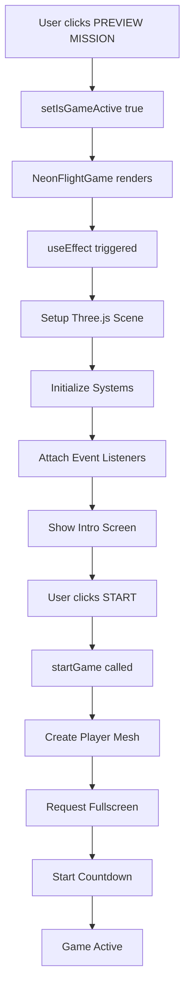

# Inventário Completo: Integração do Jogo no Site TypeScript

## 📋 Visão Geral

Este documento cataloga a integração completa do jogo **Neon Flight** no site TypeScript Next.js, mapeando a árvore DOM desde a raiz até o componente do jogo.

---

## 🌳 Hierarquia DOM Completa

### Nível 1: Aplicação Next.js (Raiz)
```
_app.tsx (Next.js Application Root)
  ↓
pages/index.tsx (Home Page Component)
```

### Nível 2: Página Principal (`index.tsx`)

**Localização**: `c:\Users\milto\Documents\profile-page\src\pages\index.tsx`

**Estrutura de Componentes**:
```tsx
Home Component (lines 343-349)
  ↓
ClientOnly Wrapper (line 345)
  ↓
HomeContent Component (lines 45-340)
  ↓
ScrollContainer (line 121)
  ↓
SectionWrapper#experience (lines 149-293)
```

### Nível 3: Seção de Experiência (Experience Section)

**Container Principal** (linha 149):
```tsx
<SectionWrapper 
  id="experience" 
  vPadding="pb-14 pt-48" 
  className="relative min-h-screen flex flex-col items-center justify-center overflow-hidden"
>
```

**Estrutura Interna**:
```
Header & Tabs Container (linha 152)
  ├── Badge (linha 155)
  ├── Title (linha 162)
  ├── Description (linha 167)
  └── Tab Buttons (linha 172)
      ├── Game Dev Tab (activeTab === 'game')
      ├── Web Dev Tab (activeTab === 'web')
      └── Mentor Tab (activeTab === 'mentor')

Content Area (linha 198)
  └── Game Dev Content (linha 201)
      ├── Slideshow Preview (!isGameActive) (linha 203)
      └── NeonFlightGame Component (isGameActive) (linha 264)
```

### Nível 4: Componente do Jogo

**Invocação** (linha 264 de `index.tsx`):
```tsx
<NeonFlightGame onExit={() => setIsGameActive(false)} />
```

**Arquivo**: `c:\Users\milto\Documents\profile-page\src\components\games\fly\components\NeonFlightGame.tsx`

---

## 🎮 Estrutura do Componente NeonFlightGame

### Refs Principais

```typescript
// Linha 57-58
const containerRef = useRef<HTMLDivElement>(null);  // Container principal
const canvasRef = useRef<HTMLDivElement>(null);     // Canvas do Three.js
const playerRef = useRef<THREE.Group>(null);        // Grupo do avião
```

### Renderização DOM

```tsx
// Estrutura renderizada (linhas 800-950)
<div 
  ref={containerRef}
  className="fixed inset-0 z-50 bg-black"
  style={{ cursor: gameState.gameActive ? 'none' : 'default' }}
>
  {/* Canvas Container */}
  <div 
    ref={canvasRef}
    className="absolute inset-0"
  />
  
  {/* UI Overlays */}
  <div id="intro-screen">...</div>
  <div id="pause-screen">...</div>
  <div id="hud">...</div>
  <div id="countdown">...</div>
  <div id="thank-you-screen">...</div>
</div>
```

### Three.js Scene Setup

**Renderer** (linhas 147-160):
```typescript
const renderer = new THREE.WebGLRenderer({ antialias: true, alpha: false });
renderer.setSize(width, height);
renderer.setPixelRatio(Math.min(window.devicePixelRatio, 1.5));

// CRITICAL: Canvas positioning
renderer.domElement.style.position = 'absolute';
renderer.domElement.style.top = '0';
renderer.domElement.style.left = '0';
renderer.domElement.style.width = '100%';
renderer.domElement.style.height = '100%';

canvasRef.current.appendChild(renderer.domElement);
```

**Camera** (linhas 138-145):
```typescript
const camera = new THREE.PerspectiveCamera(
  60,                    // FOV
  width / height,        // Aspect ratio
  0.1,                   // Near plane
  2000                   // Far plane
);
camera.position.set(0, 2.0, 5.0);
```

---

## 🔧 Sistemas do Jogo

### 1. Input System
**Arquivo**: `src/components/games/fly/systems/InputSystem.ts`

**Responsabilidade**: Captura eventos de mouse e teclado

**Inicialização** (linha 234 de NeonFlightGame.tsx):
```typescript
const inputSystem = setupInputSystem(gameState, containerRef);
```

### 2. Physics System
**Arquivo**: `src/components/games/fly/systems/PhysicsSystem.ts`

**Responsabilidade**: Atualiza posição do avião baseado no mouse

**Inicialização** (linha 231):
```typescript
const physicsSystem = setupPhysicsSystem(gameState, playerRef, scene);
```

### 3. Camera System
**Arquivo**: `src/components/games/fly/systems/CameraSystem.ts`

**Responsabilidade**: Controla câmera que segue o avião

**Inicialização** (linha 232):
```typescript
const cameraSystem = setupCameraSystem(gameState, playerRef, camera);
```

### 4. UI System
**Arquivo**: `src/components/games/fly/systems/UISystem.ts`

**Responsabilidade**: Gerencia HUD e telas de UI

**Inicialização** (linha 233):
```typescript
const uiSystem = setupUISystem(gameState, uiRefs);
```

---

## 📦 Props e State Flow

### Props do Componente

```typescript
interface NeonFlightGameProps {
  onExit: () => void;      // Callback para sair do jogo
  autoLaunch?: boolean;    // Auto-iniciar (padrão: true)
}
```

### State Principal (GameState)

**Definição** (linhas 84-127):
```typescript
const gameState: GameState = {
  // Controle do jogo
  gameActive: false,
  isPaused: false,
  controlsLocked: false,
  isPointerLocked: false,
  
  // Mouse virtual (CRÍTICO para posicionamento)
  virtualMouseX: 0,        // Range: -1 a 1
  virtualMouseY: 0,        // Range: -1 a 1
  mouseSensitivity: 0.002,
  
  // Física
  speed: 0,
  rotationZ: 0,
  rotationX: 0,
  
  // Gameplay
  paperIntegrity: 100,
  score: 0,
  
  // Manobras
  isRolling: false,
  isTurbo: false,
  isCinematic: false,
  
  // Input
  keys: { w, a, s, d, space, f, c, z, p }
};
```

### State Local (React)

```typescript
const [isLaunched, setIsLaunched] = useState(true);  // Linha 60
```

---

## 🎨 CSS e Styling

### Container Styling

**SectionWrapper** (de `index.tsx`):
```css
className="relative min-h-screen flex flex-col items-center justify-center overflow-hidden"
```

**Game Container** (renderizado pelo NeonFlightGame):
```css
className="fixed inset-0 z-50 bg-black"
```

**Canvas Container**:
```css
className="absolute inset-0"
```

### Fontes Importadas

```typescript
import "@fontsource/space-mono";  // Linha 6 de NeonFlightGame.tsx
```

---

## 🔄 Event Handlers

### Event Listeners Globais

**Linha 771-775** (NeonFlightGame.tsx):
```typescript
window.addEventListener("pointerdown", handlePointerDown);
window.addEventListener("resize", handleResize);
window.addEventListener("keydown", handleKeyDownGlobal);
document.addEventListener("pointerlockchange", handlePointerLockChange);
document.addEventListener("fullscreenchange", handleFullscreenChange);
```

### Event Listeners do Container

**InputSystem.ts linha 132**:
```typescript
containerRef.current.addEventListener("mousemove", handleMouseMove);
```

---

## 🎯 Fluxo de Inicialização



---

## 📊 Dependências

### Pacotes Three.js

```json
{
  "three": "^0.x.x",
  "@types/three": "^0.x.x"
}
```

### Loaders

```typescript
import { GLTFLoader } from "three/examples/jsm/loaders/GLTFLoader.js";
```

### Modelo 3D

```typescript
// Linha 193
"https://raw.githubusercontent.com/Domenicobrz/R3F-takes-flight/episode_1/public/assets/models/airplane.glb"
```

---

## 🔍 Pontos de Integração Críticos

### 1. Dimensionamento do Canvas

**Problema Potencial**: Canvas deve usar dimensões do container, não da window

**Solução** (linhas 135-136):
```typescript
const width = containerRef.current ? containerRef.current.clientWidth : window.innerWidth;
const height = containerRef.current ? containerRef.current.clientHeight : window.innerHeight;
```

### 2. Posicionamento Absoluto

**Canvas** (linhas 152-156):
```typescript
renderer.domElement.style.position = 'absolute';
renderer.domElement.style.top = '0';
renderer.domElement.style.left = '0';
renderer.domElement.style.width = '100%';
renderer.domElement.style.height = '100%';
```

### 3. Event Listener Scope

**Mouse events** devem ser anexados ao `containerRef`, não ao `window`:
```typescript
// InputSystem.ts linha 132
containerRef.current.addEventListener("mousemove", handleMouseMove);
```

---

## 🚀 Lifecycle

### Mount
1. Component renders
2. useEffect executes
3. Three.js scene created
4. Systems initialized
5. Event listeners attached
6. Animation loop starts

### Unmount
**Cleanup** (linhas 785-804):
```typescript
return () => {
  inputSystem.detach();
  window.removeEventListener("pointerdown", handlePointerDown);
  window.removeEventListener("resize", handleResize);
  window.removeEventListener("keydown", handleKeyDownGlobal);
  document.removeEventListener("pointerlockchange", handlePointerLockChange);
  document.removeEventListener("fullscreenchange", handleFullscreenChange);
};
```

---

## 📝 Notas Importantes

1. **ClientOnly Wrapper**: O jogo é envolvido em `<ClientOnly>` para evitar SSR issues
2. **Auto-launch**: Por padrão, `isLaunched` é `true` (linha 60)
3. **Fullscreen**: O jogo solicita fullscreen ao iniciar (linha 516)
4. **Pointer Lock**: Não está sendo usado atualmente (modo não-pointer-lock)
5. **Responsive**: O jogo responde a resize events (linha 747)
